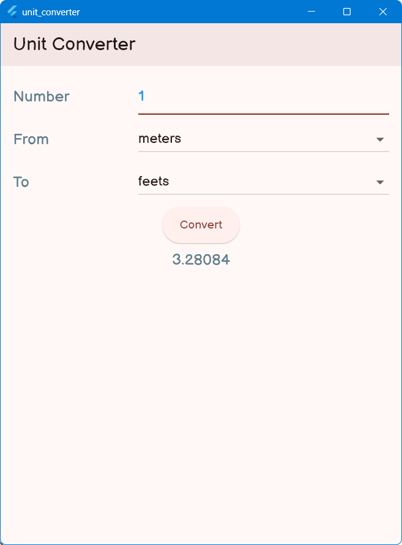

# unit_converter

## Background
This is my own implementation of final work from Chapter 2 of "Flutter Projects: A practical, project-based guide to building real-world crossplatform mobile applications and games" book by the Simone Alessandria.

The point of learning is to learn and improvise oneself. Thence, here are features that I added on top of the original code so that I would not consider my self as a complete *copy-cat* (while technically-speaking everyone is a copy-cat in programming).
1. Better UI layout by utilising the `Flex()` class.
2. Better code structure to understand (for me atleast, or for those who are used to imperative code style like C).
3. Tried my best for as explicit as possible, since `explicit is better than implicit`. Dart's data types are there to be used not to be slacking around. Avoid using `dynamic` or `object` or whatever that could be interpreted as the other thing.

## Compiling and running
Code warning:
1. This code is intended as a "hello world"-level code. Please expect inconsistencies in code structures.
2. Please expect a distinct code style, either it will help you understand the code faster or it will make you suffer more to read the code.

Requirements to compile and run code:
1. A working Dart version 3.2 or newer.
2. A working Flutter version 3.16 or newer.
3. A working Android Studio Narwhal or newer if you are targetting Android platform.

Compiling the code is just like compiling normal Flutter project:
1. Navigate to this project's directory in the console.
2. Type `run` and hit the `enter` button.
3. If it asks where you would like to run the application, simply choose the one you prefer by typing the number.
4. If the application is laggy, it is normal because of the debug mode of Flutter. Type `run release` in the console (step 2) so that the Flutter will go full-blast mode.

## Thoughts
Flutter weaknesses are state management and navigation. Why? Because Flutter litteraly does have 3rd party library for handling those stuffs. Not only that, the `setState()` function literally accepts a single parameter which is a pointer to an other function. Silly.

I guess the decision was made because it is following the principle of functional programming paradigm where the nature of that paradigm is `there is no place for undefined behaviour`. Good intention, but still silly.

## Screenshots

